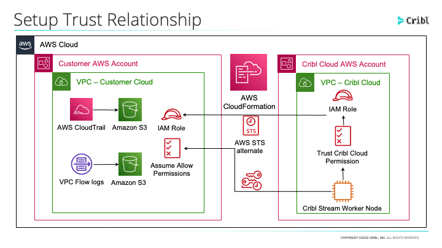

# Cribl CloudFormation Templates

Welcome to the Cribl CloudFormation Templates Repository. These templates are to be used with the [Cribl AMI's available on the Amazon Marketplace](https://aws.amazon.com/marketplace/search/results?prevFilters=%7B%22productId%22%3A%22prod-y3sx4ombltb5u%22%7D&searchTerms=cribl&CREATOR=57d65874-00f7-4c7f-9d3a-2d6d59e183f0&PRICING_MODEL=FREE&FULFILLMENT_OPTION_TYPE=AMAZON_MACHINE_IMAGE&filters=CREATOR%2CPRICING_MODEL%2CFULFILLMENT_OPTION_TYPE). Once subscribed, users can deploy Cribl Stream into their AWS Environments using the templates below. 
----

## Support
For questions about these templates, please either create an issue on this repo or reach out to our [community slack](https://cribl-community.slack.com) and search for the #cribl-aws-cloudformation channel. 

---
## Templates

### Cribl Cloud Workshop Template

This template will deploy an IAM trust relationship between your AWS account and the Cribl Cloud tenant. The template will also create two supporting S3 buckets for testing purposes (s3DefaultSIEM and s3DefaultSecurityLake). The newly created IAM role will have access to read and write from these S3 buckets. You can update the IAM Role Policy to include any additional S3 buckets or other AWS resources you want to give Cribl access to. 

Here is the Cloudformation Template [template](templates/s3bucketcollection/template/cribl_cloud_trust.yaml) |  [documentation](/templates/s3bucketcollection/documentation/Cribl%20Cloud%20Trust%20IAM%20Role%20CloudFormation%20Template.md)

### Single Instance Deployment Template

This template will deploy a single Cribl Stream tenant along with an application load balancer, an S3 bucket, an autoscale group and one Security Group. This will deploy in one Public Subnet in your VPC and will create a security group. 

A good use case for this type of deployment is to test Cribl Stream or Edge.

The CloudFormation Template for ARM64 is available [template](templates/single/template/free_arm64_template.yaml) | [documentation](/templates/single/documentation/Cribl%20Stream%20Single%20Instance%20Deployment%20(arm64).md)

The CloudFormation Template for x86_64 is available [template](templates/single/template/free_x86_64_template.yaml) | [documentation](/templates/single/documentation/Cribl%20Stream%20Single%20Instance%20Deployment%20(x86_64).md)

### Distributed Deployment Template

This template will deploy one Cribl Stream Leader node and at least one Cribl Stream Worker node. These nodes will be added to their own Autoscale Groups. Two load balancers will also be deployed, one Application Load Balancer for web traffic and a Network Load Balancer for communication between the workers and leader (TCP 4200). You will need at least two Public Subnets and two availability zones for this deployment. An S3 bucket along with a security group will be created in your AWS environment. 

The CloudFormation Template for ARM64 is available [template](templates/distributed/template/free_arm64_template.yaml) | [documentation](/templates/distributed/documentation/Cribl%20Stream%20Distributed%20(arm64).md)

The CloudFormation Template for x86_64 is available [template](templates/distributed/template/free_x86_64_template.yaml) | [documentation](/templates/distributed/documentation/Cribl%20Stream%20Distributed%20(amd64).md)

### Hybrid Workers 

This template will deploy one Network Load Balancer, an autoscale group with at least one Cribl Worker node and an S3 bucket. You will be required to have a Cribl Cloud instance or distributed Cribl instance to leverage this CloudFormation template. 

The CloudFormation Template for ARM64 is available [template](templates/hybridworkers/template/free_arm64_template.yaml) | [documentation](/templates/hybridworkers/documentation/Cribl%20Stream%20Hybrid%20Worker%20Deployment%20(arm64).md)

The CloudFormation Template for x86_64 is available [template](templates/hybridworkers/template/free_x86_64_template.yaml) | [documentation](/templates/hybridworkers/documentation/Cribl%20Stream%20Hybrid%20Worker%20Deployment%20(amd64).md)

### PrivateLink

Similar to the Distributed Deployment above, this template will deploy one Cribl Stream Leader node and at least one Cribl Stream Worker node. These nodes will be added to their own Autoscale Groups. Two load balancers will also be deployed, one Application Load Balancer for web traffic and a Network Load Balancer for communication between the workers and leader (TCP 4200). You will need at least two Public Subnets and two availability zones for this deployment. An S3 bucket along with a security group will be created in your AWS environment. 

The main difference is that this template will create a PrivateLink connection available for you to send traffic from various endpoints through this PrivateLink. 

The CloudFormation Template for ARM64 is available [template](templates/privatelink/template/free_arm64_template.yaml)

The CloudFormation Template for x86_64 is available [template](templates/privatelink/template/free_x86_64_template.yaml)

### Cribl Stream S3 Bucket Collection

This template will create an IAM Role, Policy and SQS that will attach to the exsting S3 bucket that is being used to store data. The role that is being used to deploy this CloudFormation template needs to have the rights to update the S3 bucket's properties and create an SQS, IAM Role and Policy. 

The CloudFormation Template to create a new VPC and CloudTrail loggging S3 bucket [template](templates/s3bucketcollection/template/cribl_cloud_enable_ct_vpc.yaml) | [documentation](/templates/s3bucketcollection/documentation/Enable%20CloudTrail%20and%20VPC%20Flow%20Logging.md)

The CloudFormation Template for an existing VPC Flow Log S3 bucket is available [template](templates/s3bucketcollection/template/existing_vpc_s3_trust.yaml) | [documentation](/templates/s3bucketcollection/documentation/Cribl%20Cloud%20Trust%20IAM%20Role%20for%20VPC%20Flow%20Logs%20Acces.md)

The CloudFormation Template for an existing CloudTrail S3 bucket is available [template](templates/s3bucketcollection/template/existing_cloudtrail_s3_trust.yaml) | [documentation](/templates/s3bucketcollection/documentation/Cribl%20Cloud%20Trust%20IAM%20Role%20for%20CloudTrail%20Access.md)