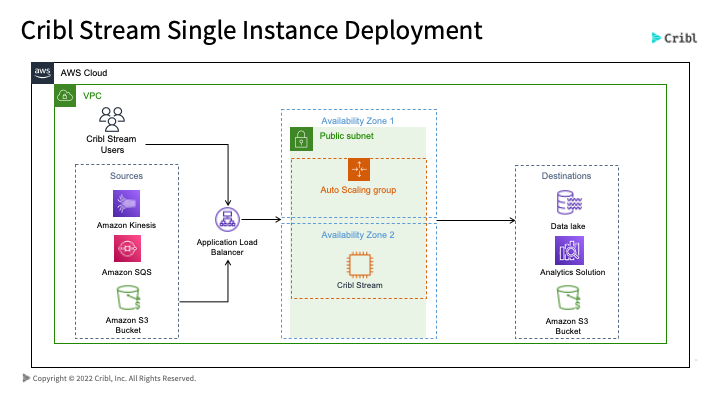
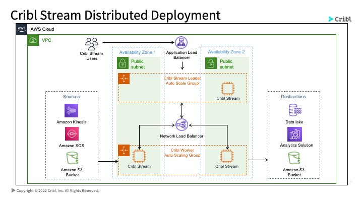
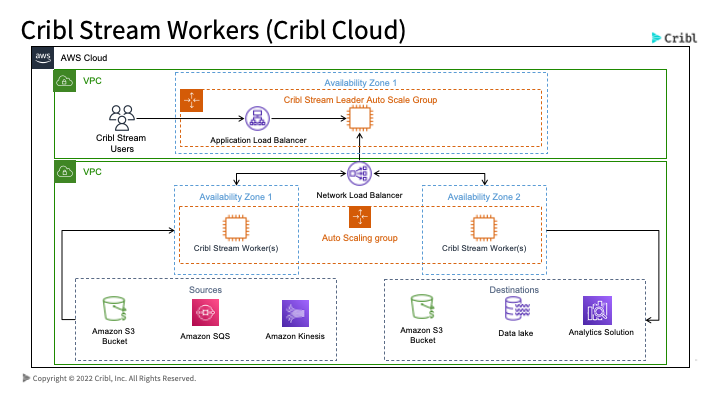
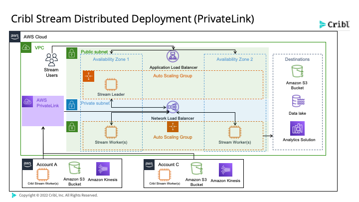

# Cribl CloudFormation Templates

Welcome to the Cribl CloudFormation Templates Repository. These templates are to be used with the [Cribl AMI's available on the Amazon Marketplace](https://aws.amazon.com/marketplace/search/results?prevFilters=%7B%22productId%22%3A%22prod-y3sx4ombltb5u%22%7D&searchTerms=cribl&CREATOR=57d65874-00f7-4c7f-9d3a-2d6d59e183f0&PRICING_MODEL=FREE&FULFILLMENT_OPTION_TYPE=AMAZON_MACHINE_IMAGE&filters=CREATOR%2CPRICING_MODEL%2CFULFILLMENT_OPTION_TYPE).

### Single Template

This template will deploy a single Cribl Stream tenant along with an application load balancer, an S3 bucket, an autoscale group and one Security Group. This will deploy in one Public Subnet in your VPC and will create a security group. 

A good use case for this type of deployment is to test Cribl Stream or Edge.

The CloudFormation Template for ARM64 is available [here](templates/single/template/free_arm64_template.yaml)

The CloudFormation Template for x86_64 is available [here](templates/single/template/free_x86_64_template.yaml)

### Distributed Template

This template will deploy one Cribl Stream Leader node and at least one Cribl Stream Worker node. These nodes will be added to their own Autoscale Groups. Two load balancers will also be deployed, one Application Load Balancer for web traffic and a Network Load Balancer for communication between the workers and leader (TCP 4200). You will need at least two Public Subnets and two availability zones for this deployment. An S3 bucket along with a security group will be created in your AWS environment. 

The CloudFormation Template for ARM64 is available [here](templates/distributed/template/free_arm64_template.yaml)

The CloudFormation Template for x86_64 is available [here](templates/distributed/template/free_x86_64_template.yaml)

### CloudWorkers

This template will deploy one Network Load Balancer, an autoscale group with at least one Cribl Worker node and an S3 bucket. You will be required to have a Cribl Cloud instance or distributed Cribl instance to leverage this CloudFormation template. 

The CloudFormation Template for ARM64 is available [here](templates/cloudworkers/template/free_arm64_template.yaml)

The CloudFormation Template for x86_64 is available [here](templates/cloudworkers/template/free_x86_64_template.yaml)

### PrivateLink

Similar to the Distributed Deployment above, this template will deploy one Cribl Stream Leader node and at least one Cribl Stream Worker node. These nodes will be added to their own Autoscale Groups. Two load balancers will also be deployed, one Application Load Balancer for web traffic and a Network Load Balancer for communication between the workers and leader (TCP 4200). You will need at least two Public Subnets and two availability zones for this deployment. An S3 bucket along with a security group will be created in your AWS environment. 

The main difference is that this template will create a PrivateLink connection available for you to send traffic from various endpoints through this PrivateLink. 

The CloudFormation Template for ARM64 is available [here](templates/privatelink/template/free_arm64_template.yaml)

The CloudFormation Template for x86_64 is available [here](templates/privatelink/template/free_x86_64_template.yaml)